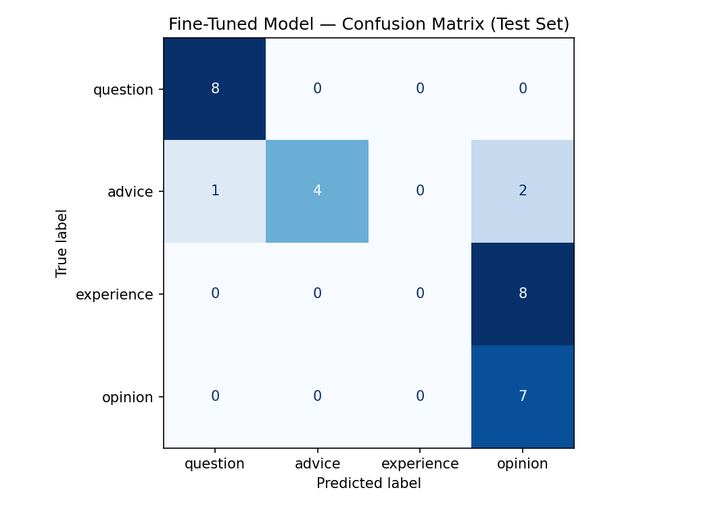

# TakeMeter

## Overview

TakeMeter is a text classification system that categorizes CU Boulder discussion posts into four categories:

* Question
* Advice
* Experience
* Opinion

The goal of the project is to train a classifier that can identify different types of student discussions and compare a fine-tuned model against a zero-shot large language model baseline.

## Community Choice and Reasoning

This project focuses on topics commonly discussed by CU Boulder students, including housing, registration, transportation, study spaces, dining, student organizations, and campus experiences.

These topics were selected because they naturally produce multiple types of discourse. Some posts ask questions, others provide advice, some describe personal experiences, and others express opinions. This makes the community a good fit for a classification task.

## Data Collection

The dataset consists of 200 labeled examples focused on common CU Boulder discussion topics.

The dataset was inspired by public CU Boulder resources and community discussions. Examples were created and labeled according to the taxonomy defined in `planning.md`.

Example sources used to understand common discussion themes:

* https://www.colorado.edu/orientation/
* https://www.colorado.edu/studentlife/
* https://www.colorado.edu/pts/
* https://www.reddit.com/r/cuboulder/

The examples were manually reviewed and assigned one of the four labels according to the definitions in the taxonomy.

## Label Taxonomy

### Question

Definition:

A post whose primary purpose is asking for information, recommendations, or help.

Examples:

* "What are the best dorms for freshmen at CU Boulder?"
* "Does anyone know quiet study spots on campus?"

### Advice

Definition:

A post whose primary purpose is giving guidance or recommending an action.

Examples:

* "Register for classes as soon as possible."
* "Use tutoring resources before you fall behind."

### Experience

Definition:

A post whose primary purpose is describing a personal experience.

Examples:

* "I transferred to CU Boulder during my sophomore year."
* "I enjoyed living in Kittredge Hall during my first year."

### Opinion

Definition:

A post whose primary purpose is expressing a judgment, preference, complaint, or reaction.

Examples:

* "Parking permits are ridiculously expensive."
* "Boulder is one of the best college towns in the country."

## Dataset

The dataset contains 200 manually labeled examples.

| Label      | Count |
| ---------- | ----: |
| Question   |    50 |
| Advice     |    50 |
| Experience |    50 |
| Opinion    |    50 |

### Train / Validation / Test Split

| Split      | Examples |
| ---------- | -------: |
| Train      |      140 |
| Validation |       30 |
| Test       |       30 |

## Difficult-to-Label Examples

### Example 1

Text:

> "Parking permits are a waste of money. Just take the bus."

Possible Labels:

- Opinion
- Advice

Final Label: Opinion

Reason:

The primary purpose is expressing a judgment about parking permits. Although the second sentence gives advice, the overall focus of the post is the opinion.

### Example 2

Text:

> "I lived off campus and saved a lot of money."

Possible Labels:

- Experience
- Opinion

Final Label: Experience

Reason:

The statement primarily describes a personal experience rather than expressing a general judgment.

### Example 3

Text:

> "You should try office hours because they helped me pass the class."

Possible Labels:

- Advice
- Experience

Final Label: Advice

Reason:

The primary purpose is recommending an action. The personal experience serves as supporting evidence.

## Spec Reflection

### How the Spec Helped

The project specification helped establish clear label definitions before data collection and training. The requirement to define edge cases made it easier to think about the difference between similar labels such as Experience and Opinion.

### How Implementation Diverged

The original goal was to fine-tune a smaller classifier and compare it against a zero-shot baseline. In the final results, the zero-shot Groq baseline performed better than the fine-tuned DistilBERT model. This changed the focus of the analysis from showing fine-tuning improvement to explaining why the fine-tuned model struggled on some label boundaries.

## Model and Training

Base model: `distilbert-base-uncased`

Training configuration:

- Epochs: 3
- Learning rate: 2e-5
- Batch size: 16
- Weight decay: 0.01

The dataset was split into training, validation, and test sets before fine-tuning.

A learning rate of 2e-5 was selected because it is a common starting point for transformer fine-tuning and helps avoid large parameter updates on a relatively small dataset.

## Baseline Model

A zero-shot baseline was created using Groq's `llama-3.3-70b-versatile`.

The model was provided with definitions for each label and instructed to return only one valid label:

- question
- advice
- experience
- opinion

The baseline predictions were evaluated on the same test set used for the fine-tuned model.

## Evaluation Results

### Accuracy Comparison

| Model | Accuracy |
|---------|---------:|
| Groq Zero-Shot Baseline | 1.000 |
| Fine-Tuned DistilBERT | 0.633 |

Test Set Size: 30 examples

### Per-Class Metrics (Fine-Tuned Model)

| Label | Precision | Recall | F1-Score | Support |
|---------|---------:|---------:|---------:|---------:|
| Question | 0.89 | 1.00 | 0.94 | 8 |
| Advice | 1.00 | 0.57 | 0.73 | 7 |
| Experience | 0.00 | 0.00 | 0.00 | 8 |
| Opinion | 0.41 | 1.00 | 0.58 | 7 |

### Per-Class Metrics (Baseline)

| Label | Precision | Recall | F1-Score | Support |
|---------|---------:|---------:|---------:|---------:|
| Question | 1.00 | 1.00 | 1.00 | 8 |
| Advice | 1.00 | 1.00 | 1.00 | 7 |
| Experience | 1.00 | 1.00 | 1.00 | 8 |
| Opinion | 1.00 | 1.00 | 1.00 | 7 |

## Confusion Matrix

### Confusion Matrix (Fine-Tuned Model)

| True Label | Predicted: Question | Predicted: Advice | Predicted: Experience | Predicted: Opinion |
|------------|-------------------:|------------------:|----------------------:|-------------------:|
| Question   | 8 | 0 | 0 | 0 |
| Advice     | 1 | 4 | 0 | 2 |
| Experience | 0 | 0 | 0 | 8 |
| Opinion    | 0 | 0 | 0 | 7 |

## Error Analysis

The strongest confusion pattern was Experience → Opinion.

All Question examples were classified correctly.

No Experience examples were correctly classified. Every Experience example in the test set was predicted as Opinion.

Advice examples were occasionally predicted as Question or Opinion.

## Sample Classifications from Fine-Tuned Model

### Correct Predictions

| Text | True Label | Predicted Label | Confidence |
|---|---|---|---:|
| "Which residence hall is closest to engineering classes?" | Question | Question | 0.30 |
| "What is the best way to get involved on campus?" | Question | Question | 0.31 |
| "Is the Buff Bus reliable during winter?" | Question | Question | 0.31 |

Example Explanation:

The model correctly classified these posts as Question because their primary purpose is to request information from other students.

### Misclassified Examples

| Text | True Label | Predicted Label | Confidence |
|---|---|---|---:|
| "I lived with roommates off campus and it helped reduce expenses." | Experience | Opinion | 0.27 |
| "Do not wait until the last minute to look for off-campus housing." | Advice | Question | 0.27 |
| "I relied heavily on the free bus system throughout my time at CU Boulder." | Experience | Opinion | 0.29 |

## Reflection

The fine-tuned model achieved 63.3% accuracy on the test set.

The strongest performance was on Question posts, while the weakest performance was on Experience posts.

The Groq zero-shot baseline achieved higher accuracy than the fine-tuned DistilBERT model on this dataset, demonstrating that a strong large language model can outperform a fine-tuned classifier when the dataset is relatively small.

## AI Usage

### Taxonomy Development

AI assistance was used to brainstorm and refine the four-category label taxonomy: Question, Advice, Experience, and Opinion. The final labels were selected because they matched the kinds of posts in the dataset and were mutually exclusive enough for manual labeling.

### Dataset Creation Assistance

AI assistance was used to help generate candidate examples related to common CU Boulder discussion topics. The examples were reviewed and assigned labels according to the taxonomy in `planning.md`.

### Evaluation and Documentation Assistance

AI assistance was used to help organize the notebook outputs into README sections. Reported metrics, confusion matrix values, and wrong-prediction examples were checked against the actual Colab output before being included.